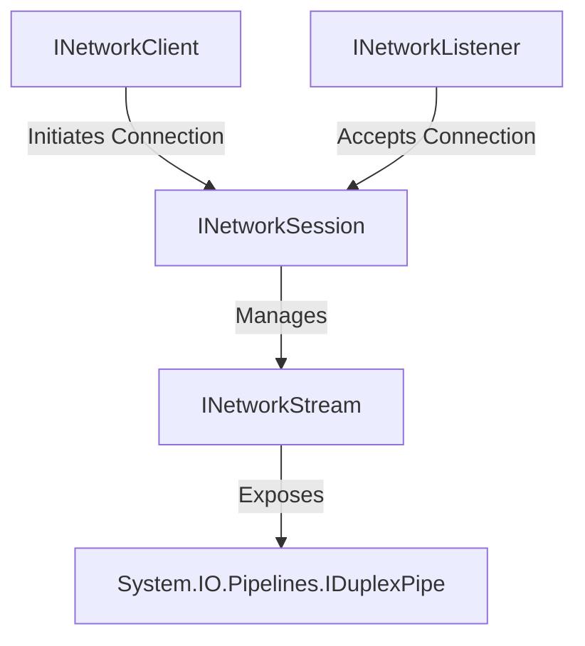

# Networking Abstractions

Beskar.Networking is built on a clean, unified abstraction layer that decouples application protocols
(like MQTT or Chat) from underlying transport implementations (such as TCP, WebSockets, or QUIC).

This is achieved via four core interfaces located in `Beskar.Networking.Abstractions`.

---

## The 4 Base Interfaces

### 1. `INetworkListener` (The Server)
Represents a server-side listener bound to a specific port and local address.
* **Responsibility**: Binds to a port, listens for incoming connections, performs security handshakes (e.g. SSL/TLS),
and accepts sessions.
* **Key API**:
  * `BindAsync(CancellationToken ct)`: Starts listening.
  * `UnbindAsync(CancellationToken ct)`: Stops listening and unbinds.
  * `AcceptSessionAsync(CancellationToken ct)`: Dequeues the next successfully established connection context.

### 2. `INetworkClient` (The Client)
Represents a client-side network connector.
* **Responsibility**: Connects to a remote server endpoint, performs client-side security handshakes,
and manages the lifecycle of the active connection session.
* **Key API**:
  * `ConnectAsync(EndPoint endpoint, CancellationToken ct)`: Initiates a new connection.
  * `DisconnectAsync(CancellationToken ct)`: Gracefully tears down the active connection.

### 3. `INetworkSession` (The Connection Context)
Represents an established, authenticated connection channel between a client and server.
* **Responsibility**: Holds session-wide metadata (remote address, creation time, connection statistics, security information) and acts as a factory for opening or accepting data streams.
* **Key API**:
  * `AcceptStreamAsync(CancellationToken ct)`: Accepts an incoming stream initiated by the remote peer.
  * `OpenStreamAsync(NetworkStreamDirection direction, CancellationToken ct)`: Opens a new stream.
  * `ActiveStreams`: Accesses a collection of all active streams.

### 4. `INetworkStream` (The Data Channel)
Represents an active communication stream within a session.
* **Responsibility**: Exposes the actual `IDuplexPipe` channel for high-performance reading and writing of bytes.
* **Key API**:
  * `Transport`: The underlying `IDuplexPipe` containing `Input` (PipeReader) and `Output` (PipeWriter).
  * `AcquireWriterLock(CancellationToken ct)`: Acquires a lock to safely write packets to the transport pipeline without race conditions.

---

## Interface Interactions & Lifecycle

When a client wants to communicate with a server:

1. **Client** calls `INetworkClient.ConnectAsync(serverEndPoint)`.
2. **Server** listener receives the connection and enqueues a session. The server application accepts
it by calling `INetworkListener.AcceptSessionAsync()`.
3. Both sides obtain a matching `INetworkSession` instance representing the connection.
4. To exchange data:
   * On transport protocols that do not support native multiplexing (like TCP), a single bidirectional
   stream is opened using `session.OpenStreamAsync()` or `session.AcceptStreamAsync()`.
   * On multiplexed protocols (like QUIC), either side can open multiple independent streams concurrently.
5. The application reads from `stream.Transport.Input` and writes to `stream.Transport.Output`.
6. When done, disposing the session gracefully closes all streams and tears down the connection.

---

## TCP Implementation Example

Here is how the TCP transport (`Beskar.Networking.Transports.Tcp`) realizes these abstractions:

### 1. `TcpNetworkListener`
1. **Binding**: `BindAsync` initializes a standard .NET `Socket` configured with `SocketType.Stream` and `ProtocolType.Tcp`, binds it to an address, and calls `socket.Listen()`.
2. **Accept Loop**: Runs a background loop invoking `socket.AcceptAsync()`.
3. **Duplex Pipe Wrapping**: On connection, it wraps the raw socket in a `SocketConnection` (which manages reading/writing via `System.IO.Pipelines` queues) or an SSL `StreamConnection`.
4. **Session Enqueuing**: Instantiates a `TcpNetworkSession` wrapping the connection and enqueues it to the session channel for the server application to retrieve.

### 2. `TcpNetworkClient`
1. **Connecting**: `ConnectAsync` instantiates a `Socket` and calls `socket.ConnectAsync()`.
2. **Authentication**: If SSL/TLS is enabled, it wraps the connection in an `SslStream` and performs client authentication.
3. **Session Creation**: Wraps the socket/stream in a `TcpNetworkSession` and returns it.

### 3. `TcpNetworkSession`
Because TCP is a single-connection transport without native stream multiplexing:
* `IsSupportingMultiplexing` returns `false`.
* `IsSupportingUnidirectional` returns `false`.
* `AcceptStreamAsync()` and `OpenStreamAsync()` both return the **same single `TcpNetworkStream` instance**
(with `StreamId = 0`) wrapping the connection's single duplex pipe.

### 4. `TcpNetworkStream`
Wraps the TCP `IDuplexPipe`. It utilizes an internal `AsyncLock` class inside `AcquireWriterLock`
to guarantee that concurrent writes (e.g. concurrent publishers sending packets, or background keep-alive pingers)
are serialized, avoiding corruption in the underlying TCP socket write buffers.
