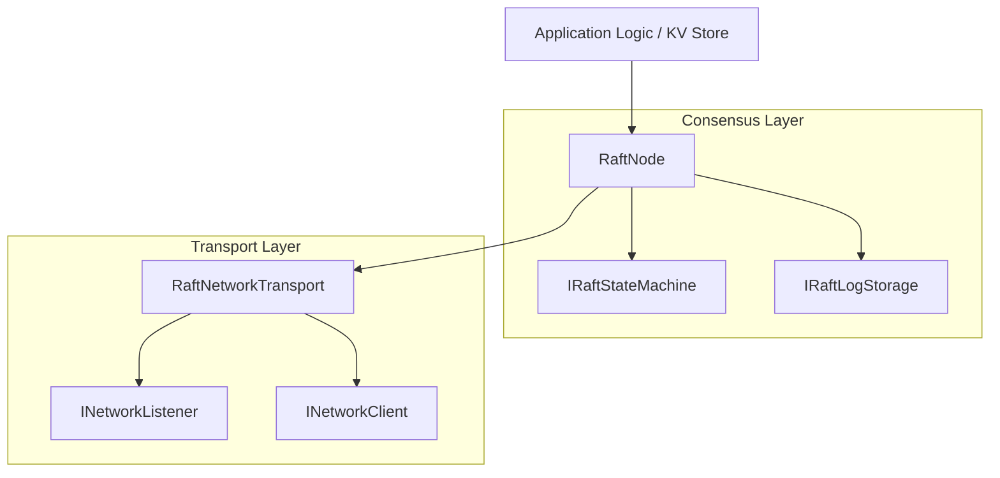
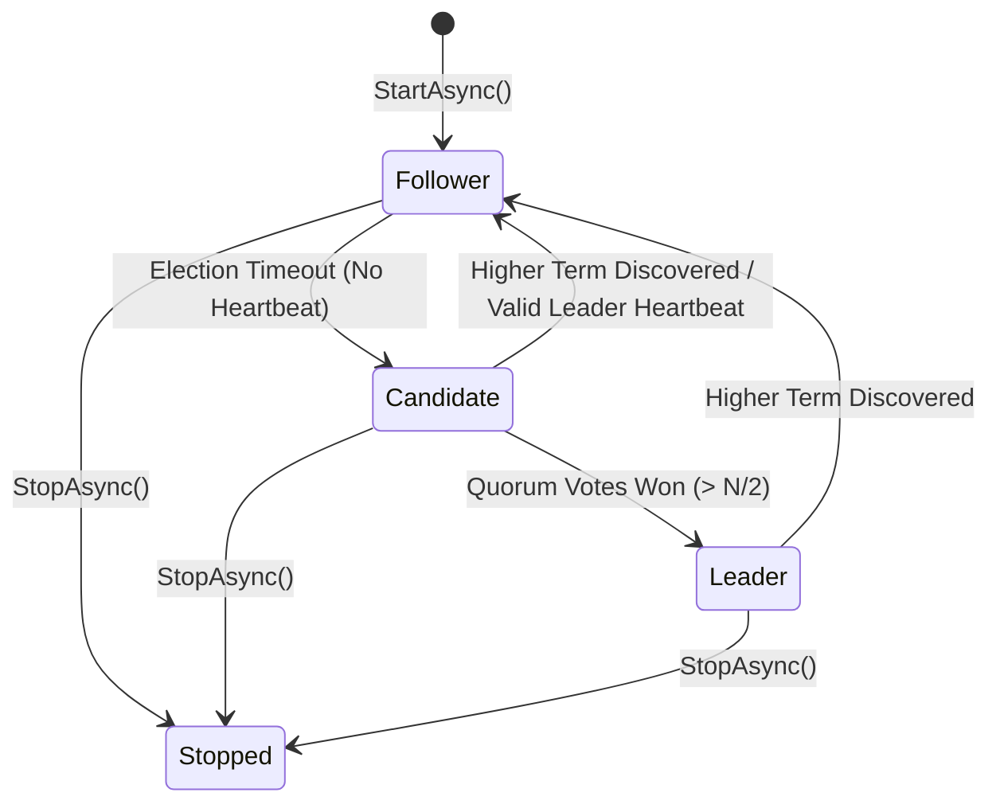

# Raft Consensus Engine Overview

The `Beskar.Networking.Raft` package provides a high-performance, low-allocation, transport-agnostic implementation of the **Raft Distributed Consensus Protocol** built natively for **.NET 10**.

It enables distributed clusters to maintain a strongly consistent, replicated append-only log across multiple nodes over any network transport provided by `Beskar.Networking` (TCP, QUIC, Named Pipes, Unix Domain Sockets, or In-Memory).

---

## 1. Core Principles

Raft is a distributed consensus algorithm designed for state machine replication across a cluster of nodes:

* **Strong Leader**: Only the elected leader accepts write proposals from clients, sequences them in log entries, and coordinates replication across followers.
* **Leader Election**: When followers miss heartbeats within their randomized election timeout window, they transition to candidates and solicit votes. A candidate wins the election when it receives votes from a majority quorum ($\lfloor N/2 \rfloor + 1$).
* **Quorum Log Replication**: The leader replicates entries to all cluster peers in parallel. An entry is committed as soon as a majority quorum has acknowledged writing it to their log.
* **Safety & State Machine Invariance**: Once an entry is committed by a quorum, it is guaranteed to never be overwritten or lost, ensuring deterministic state machine transitions across all cluster nodes.

---

## 2. Architecture & Layering

`Beskar.Networking.Raft` sits on top of the unified [`Beskar.Networking.Abstractions`](https://github.com/MarvinDrude/Beskar.Networking/tree/master/Documentation/Basics/Abstractions.md) layer.

### State Machine Lifecycle

---

## 3. Protocol & Binary Framing

The consensus engine uses zero-allocation binary framing with magic bytes `0xBE, 0x52` ("BESKAR RAFT") via [`RaftProtocolCodec`](https://github.com/MarvinDrude/Beskar.Networking/blob/master/Raft/Beskar.Networking.Raft/Protocol/Codec/RaftProtocolCodec.cs):

| RPC Type | Code | Direction | Purpose |
| :--- | :---: | :--- | :--- |
| **`RequestVote`** | `0x01` | Candidate $\rightarrow$ Peer | Gathers votes during an election term. |
| **`RequestVoteResponse`** | `0x02` | Peer $\rightarrow$ Candidate | Returns vote granted status and current term. |
| **`AppendEntries`** | `0x03` | Leader $\rightarrow$ Follower | Replicates log entries and serves as periodic heartbeat. |
| **`AppendEntriesResponse`** | `0x04` | Follower $\rightarrow$ Leader | Confirms log consistency and match index. |
| **`InstallSnapshot`** | `0x05` | Leader $\rightarrow$ Follower | Sends compacted cluster state chunks to out-of-date followers. |
| **`InstallSnapshotResponse`** | `0x06` | Follower $\rightarrow$ Leader | Confirms snapshot installation. |

---

## 4. Next Steps

- [Storage & Persistence Guide](https://github.com/MarvinDrude/Beskar.Networking/blob/master/Documentation/Raft/StorageAndPersistence.md)
- [State Machine & Proposals Guide](https://github.com/MarvinDrude/Beskar.Networking/blob/master/Documentation/Raft/StateMachineAndProposals.md)
