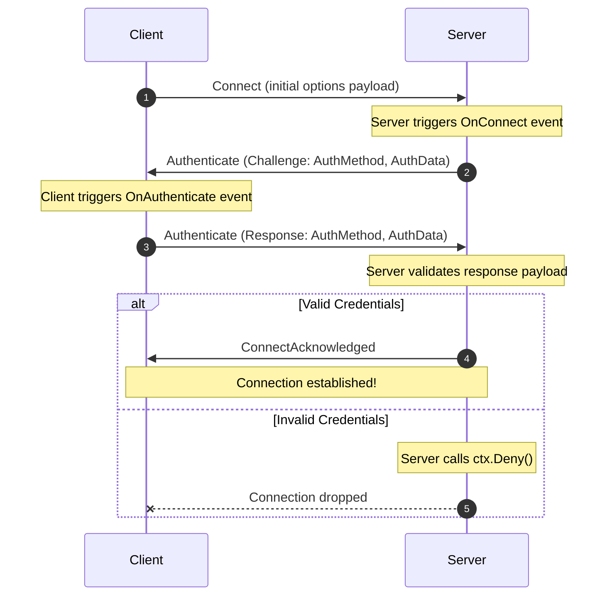

# Resilient Client & Server Authentication

The resilient networking architecture supports custom authentication handshakes using a highly flexible **Challenge-Response** pattern. This allows implementation of anything from simple token verification to multi-step cryptographic handshakes (e.g. SCRAM, HMAC challenge-response) directly within the initial connection handshake.

---

## 1. The Handshake Flow

The authentication handshake happens concurrently on the **Control Stream** before the client transitions to the `Connected` state:



### Handshake Rules:
1. **Server-Initiated Challenge**: Handshakes are initiated by the server inside the `OnConnect` pipeline. The client does not proactively send credentials in the `Connect` packet; it waits for a challenge.
2. **Synchronous/Blocking Handshake on Server**: Inside the server's `OnConnect` handler, you can call `SendAuthenticateAsync` and `ReceiveAuthenticateAsync` in sequence. The connection is held in a pre-handshake state until you exit the handler.
3. **Rejection**: At any point, the server can call `ctx.Deny()`. This immediately triggers connection termination on both sides.

---

## 2. Code Example: HMAC-SHA256 Handshake

Here is a complete, working example demonstrating an HMAC-SHA256 signature verification handshake. The server sends a random nonce (challenge) to the client, and the client returns a hash computed using a shared secret.

### Server Implementation

To handle authentication on the server, subscribe to the `OnConnect` event pipeline:

```csharp
using System.Net;
using System.Security.Cryptography;
using System.Text;
using Beskar.Networking.Protocol.Frames;
using Beskar.Networking.Protocol.Payloads;
using Beskar.Networking.Resilient.Server;
using Beskar.Networking.Resilient.Server.Contexts;

var server = ResilientServerFactory.CreateBuilder()
    .UseTcp(8000)
    .Build();

// Shared secret key known to both client and server
byte[] sharedKey = Encoding.UTF8.GetBytes("super-secret-pre-shared-key");

server.Events.OnConnect.Add(async (ctx, ct) =>
{
    // 1. Generate a random challenge (nonce)
    byte[] nonce = new byte[32];
    RandomNumberGenerator.Fill(nonce);

    var challengePayload = new AuthenticatePacketPayload
    {
        AuthMethod = "HMAC-SHA256",
        AuthData = nonce
    };

    // 2. Send the challenge packet to the client
    await ctx.SendAuthenticateAsync(challengePayload, ct);

    // 3. Await the client's authentication response
    var response = await ctx.ReceiveAuthenticateAsync(ct);

    if (response == null || response.AuthMethod != "HMAC-SHA256")
    {
        Console.WriteLine("Auth failed: Invalid authentication method or timeout.");
        ctx.Deny();
        return;
    }

    // 4. Verify the client's signature
    byte[] expectedHash;
    using (var hmac = new HMACSHA256(sharedKey))
    {
        expectedHash = hmac.ComputeHash(nonce);
    }

    if (response.AuthData == null || !CryptographicOperations.FixedTimeEquals(response.AuthData, expectedHash))
    {
        Console.WriteLine("Auth failed: Invalid client signature.");
        ctx.Deny(); // Reject client connection
        return;
    }

    Console.WriteLine($"Client {ctx.Client.Id} authenticated successfully!");
    // Exit cleanly to allow connection establishment
});

await server.StartAsync();
```

### Client Implementation

To participate in the handshake on the client, register a handler in the `OnAuthenticate` pipeline:

```csharp
using System.Net;
using System.Security.Cryptography;
using System.Text;
using Beskar.Networking.Protocol.Frames;
using Beskar.Networking.Protocol.Payloads;
using Beskar.Networking.Resilient.Client;
using Beskar.Networking.Resilient.Client.Contexts;

byte[] sharedKey = Encoding.UTF8.GetBytes("super-secret-pre-shared-key");

var client = ResilientClientFactory.CreateTcp<BeskarPacket>();

client.Events.OnAuthenticate.Add(async (ctx, ct) =>
{
    var challenge = ctx.ChallengePayload;

    if (challenge.AuthMethod == "HMAC-SHA256" && challenge.AuthData != null)
    {
        // 1. Compute HMAC signature over the server's nonce challenge
        byte[] signature;
        using (var hmac = new HMACSHA256(sharedKey))
        {
            signature = hmac.ComputeHash(challenge.AuthData);
        }

        var responsePayload = new AuthenticatePacketPayload
        {
            AuthMethod = "HMAC-SHA256",
            AuthData = signature
        };

        // 2. Transmit the cryptographic response back to the server
        await ctx.SendAuthenticateResponseAsync(responsePayload, ct);
    }
    else
    {
        throw new NotSupportedException($"Unsupported auth method: {challenge.AuthMethod}");
    }
});

// Initiate connection
var result = await client.ConnectAsync(new IPEndPoint(IPAddress.Loopback, 8000));
if (result.Failed)
{
    Console.WriteLine($"Connection failed: {result.Error.Message}");
}
```

---

## 3. Multi-Step Authentication (e.g. SCRAM)

Because `SendAuthenticateAsync` and `ReceiveAuthenticateAsync` are fully asynchronous and repeatable, you can perform multi-step authentication exchanges (like SCRAM-SHA-256 or SASL handshakes) simply by making consecutive calls.

### Example Multi-Step Server Logic:

```csharp
server.Events.OnConnect.Add(async (ctx, ct) =>
{
    // Step 1: Send client salt and iteration parameters
    await ctx.SendAuthenticateAsync(new AuthenticatePacketPayload 
    { 
        AuthMethod = "SCRAM-SHA-256", 
        AuthData = Encoding.UTF8.GetBytes("salt=abc,iterations=4096")
    }, ct);
    
    var step1Response = await ctx.ReceiveAuthenticateAsync(ct);
    if (step1Response == null || !IsValidStep1(step1Response.AuthData))
    {
        ctx.Deny();
        return;
    }

    // Step 2: Send server signature verifier
    await ctx.SendAuthenticateAsync(new AuthenticatePacketPayload 
    { 
        AuthMethod = "SCRAM-SHA-256", 
        AuthData = Encoding.UTF8.GetBytes("server-verifier-signature")
    }, ct);
    
    var step2Response = await ctx.ReceiveAuthenticateAsync(ct);
    if (step2Response == null || !IsValidStep2(step2Response.AuthData))
    {
        ctx.Deny();
    }
});
```
