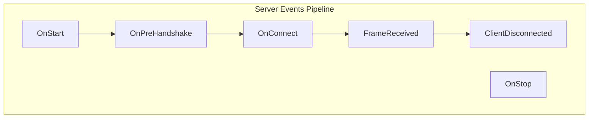

# Resilient Client & Server Events

Both the `ResilientServer` and `ResilientClient` expose a series of powerful event pipelines that allow application code to hook into key lifecycles, inspect metadata, perform authentication, and process incoming frames.

---

## 1. The `HandlerPipeline<T>` Model

Instead of standard C# `event` multicast delegates (which can be difficult to run asynchronously, order, or cancel), the resilient architecture uses a custom `HandlerPipeline<TContext>` system.

* **Sequential Execution**: Handlers are registered using `.Add(Func<TContext, CancellationToken, ValueTask>)` and executed sequentially in the order they were registered.
* **Error Resilience**: The pipeline supports different execution strategies (e.g. `SequentialContinueOnError`) to prevent a single failing handler from breaking the connection loop.
* **Thread Safety**: Internally thread-safe to ensure that dynamic registration of handlers does not cause race conditions.

---

## 2. Server Events

All server-side events are located under `server.Events`:

### `OnStart`
Fired when the server starts listening on all configured transports.
* **Context Type**: `ResilientServerStartContext<TFrame>`
* **Key Properties**:
  * `Server`: Reference to the `ResilientServer` instance.
* **Usage**: Ideal for setting up background service processes or initializing caches when the server becomes active.

### `OnPreHandshake`
Fired when a raw socket or transport session connects to the port, **before** the resilient framing protocol has read any client metadata or established a handshake.
* **Context Type**: `ResilientPreHandshakeContext<TFrame>`
* **Key Properties**:
  * `Session`: The underlying raw `INetworkSession` connection context.
  * `Listener`: The `INetworkListener` that accepted the session.
  * `IsDenied` / `Deny()`: Set to `true` or call `Deny()` to immediately terminate the TCP session without responding.
* **Usage**: Great for IP white-listing, firewalling, or limiting connection rates prior to authentication.

### `OnConnect`
Fired when a client successfully sends its initial `Connect` framing payload.
* **Context Type**: `ResilientClientConnectContext<TFrame>`
* **Key Properties**:
  * `Client`: The `ResilientServerClient` wrapper representing this connection.
  * `ConnectPayload`: The deserialized `ConnectPacketPayload` from the client (contains negotiated keep-alive time).
  * `IsDenied` / `Deny()`: Rejects the handshake and drops the connection.
  * `SendAuthenticateAsync(...)`: Sends a challenge `AuthenticatePacketPayload` to the client.
  * `ReceiveAuthenticateAsync(...)`: Awaits the client's response payload.
* **Usage**: Core hook for authentication checks and challenge-response handshakes.

### `FrameReceived`
Fired when a new protocol frame is received from a client.
* **Context Type**: `ResilientFrameReceivedContext<TFrame>`
* **Key Properties**:
  * `Client`: The client that sent the frame.
  * `Stream`: The `INetworkStream` on which the frame arrived.
  * `Frame`: The actual parsed `TFrame` instance.
* **Usage**: Processing application messages. By default, only triggers for `ResilientFrameKind.Message` frames. Set `FrameReceivedAllPackets = true` in options to receive control frames (e.g. pings, connects) here as well.

### `ClientDisconnected`
Fired asynchronously when a client drops its connection or gracefully disconnects.
* **Context Type**: `ResilientClientDisconnectedContext<TFrame>`
* **Key Properties**:
  * `Client`: The client instance that disconnected (including its last known `DisconnectPayload`).
* **Usage**: Cleaning up client session maps, updating database status, or publishing offline events.

### `OnStop`
Fired when the server is stopped and all client connections are closed.
* **Context Type**: `ResilientServerStopContext<TFrame>`
* **Key Properties**:
  * `Server`: Reference to the `ResilientServer`.

---

## 3. Client Events

All client-side events are located under `client.Events`:

### `OnConnected`
Fired when the client successfully establishes a TCP connection and finishes the resilient handshake (including any authentication checks).
* **Context Type**: `ResilientClientConnectedContext<TFrame>`
* **Key Properties**:
  * `Client`: The `ResilientClient` instance.
* **Usage**: Triggering initial sync requests, subscribing to topics, or resuming application flows.

### `OnDisconnected`
Fired when the client becomes disconnected from the server.
* **Context Type**: `ResilientClientDisconnectedContext<TFrame>`
* **Key Properties**:
  * `Client`: The client instance.
  * `DisconnectPayload`: The final disconnect message metadata, if sent by the server.
* **Usage**: Notifying UI, disabling connection-dependent buttons, or clearing active caches.

### `OnReconnecting`
Fired when a disconnected client is preparing to make an automatic reconnection attempt.
* **Context Type**: `ResilientClientReconnectingContext<TFrame>`
* **Key Properties**:
  * `Client`: The client instance.
  * `Attempt`: The count of the current attempt (1-based).
  * `LastException`: The `Exception` that caused the disconnect (or `null` if unknown).
* **Usage**: Displaying status banners, applying custom back-off intervals, or logging diagnostics.

### `OnAuthenticate`
Fired when the server issues a challenge request during the connection handshake.
* **Context Type**: `ResilientClientAuthenticateContext<TFrame>`
* **Key Properties**:
  * `Client`: The client instance.
  * `ChallengePayload`: The authentication challenge data sent from the server.
  * `SendAuthenticateResponseAsync(...)`: Transmits the resolved challenge or credentials back to the server.
* **Usage**: Solving cryptographic challenges, supplying tokens/passwords, or performing OAuth handshakes.

### `FrameReceived`
Fired when a protocol frame is received from the server.
* **Context Type**: `ResilientClientFrameReceivedContext<TFrame>`
* **Key Properties**:
  * `Client`: The client instance.
  * `Stream`: The stream on which the frame arrived.
  * `Frame`: The received `TFrame`.
* **Usage**: Dispatching incoming server commands or data payloads to their corresponding application workflows.
