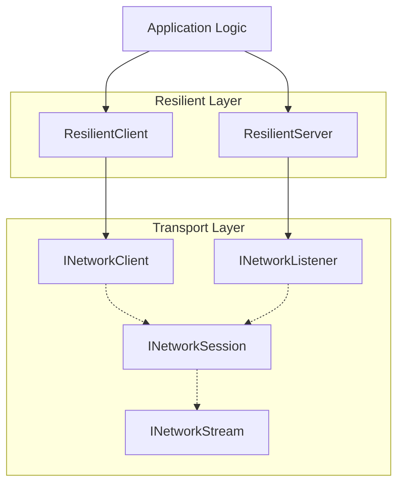

# Resilient Client & Server Overview

The `Beskar.Networking.Resilient` namespace provides a high-level, production-ready, connection-resilient
wrapper around the low-level [Networking Abstractions](https://github.com/MarvinDrude/Beskar.Networking/tree/master/Documentation/Basics/Abstractions.md).

It is designed to automatically handle network dropouts, transient disconnects, keep-alive ping/pong checks,
and complex connection handshakes, so that application code can focus entirely on high-performance message exchange.

---

## 1. General Idea

Unlike standard sockets or raw transports that instantly fail or enter unrecoverable states when the
remote peer disconnects or network packets are dropped, the **Resilient Client** and **Resilient Server** implement:

* **Automatic Reconnection**: The client automatically reconnects and re-establishes its connection state when a transport-level error or connection drop occurs.
* **Integrated Keep-Alives**: Automatic ping/pong frames are exchanged on a configurable interval to detect silent or half-open TCP connections.
* **Control Handshakes**: Standardized `Connect`, `ConnectAcknowledged`, and `Disconnect` control payloads ensure clean setup, options negotiation, and teardown.
* **Multiplexed Transport Support**: Transparent support for both single-stream transports (TCP, WebSockets, Named Pipes) and native multiplexed transports (QUIC).

---

## 2. Architecture & Layering

The resilient framework operates as a layer directly above the core `INetworkClient` and `INetworkListener`
implementations.



### The Control Stream
When a session is established, both client and server automatically open and negotiate a **Control Stream** (Stream ID `0`). This control stream is used to exchange:
1. **`Connect`**: Initial frame sent by the client containing settings such as the negotiated keep-alive time.
2. **`Authenticate`**: Optional challenge-response frames during the connection handshake.
3. **`ConnectAcknowledged`**: Sent by the server to confirm successful handshake.
4. **`Ping` / `Pong`**: Heartbeat frames sent periodically to verify the session remains active.
5. **`Disconnect`**: Sent gracefully by either peer to request clean session termination.

If the transport supports native multiplexing (e.g. QUIC), application developers can open additional streams (`session.OpenStreamAsync()`) for high-performance parallel message processing, leaving the control stream dedicated to protocol lifecycles.

---

## 3. Standard Easy Setup

Below is a simple example showing how to set up and run a resilient TCP server and client.

### Server Setup

```csharp
using System.Net;
using Beskar.Networking.Protocol.Frames;
using Beskar.Networking.Resilient.Server;
using Beskar.Networking.Resilient.Server.Contexts;

// 1. Create a server builder with the default BeskarPacket framing protocol
var serverBuilder = ResilientServerFactory.CreateBuilder()
    .UseTcp(8000); // Listen on TCP port 8000

// 2. Build the ResilientServer
var server = serverBuilder.Build();

// 3. Register server event handlers
server.Events.OnStart.Add((ctx, ct) =>
{
    Console.WriteLine("Resilient server started on port 8000!");
    return ValueTask.CompletedTask;
});

server.Events.FrameReceived.Add((ctx, ct) =>
{
    var frame = ctx.Frame;
    // Extract read-only sequence of payload bytes
    var payload = frame.GetPayloadSequence();
    Console.WriteLine($"Received message from client {ctx.Client.Id}. Length: {payload.Length}");
    return ValueTask.CompletedTask;
});

server.Events.ClientDisconnected.Add((ctx, ct) =>
{
    Console.WriteLine($"Client {ctx.Client.Id} disconnected.");
    return ValueTask.CompletedTask;
});

// 4. Start listening
await server.StartAsync();
```

### Client Setup

```csharp
using System.Net;
using Beskar.Networking.Protocol.Frames;
using Beskar.Networking.Resilient.Client;

// 1. Create client configuration options
var clientOptions = new ResilientClientOptions
{
    KeepAlive = new ResilientClientKeepAliveOptions
    {
        KeepAliveInterval = TimeSpan.FromSeconds(15) // Ping every 15s
    },
    Reconnecting = new ResilientClientReconnectionOptions
    {
        AutoReconnect = true,
        RetryInterval = TimeSpan.FromSeconds(2),
        MaxRetries = 10
    }
};

// 2. Create the TCP client with BeskarPacket framing
var client = ResilientClientFactory.CreateTcp<BeskarPacket>(clientOptions: clientOptions);

// 3. Register client events
client.Events.OnConnected.Add((ctx, ct) =>
{
    Console.WriteLine("Client connected and handshaked!");
    return ValueTask.CompletedTask;
});

client.Events.OnDisconnected.Add((ctx, ct) =>
{
    Console.WriteLine("Client disconnected.");
    return ValueTask.CompletedTask;
});

client.Events.OnReconnecting.Add((ctx, ct) =>
{
    Console.WriteLine($"Client reconnecting... Attempt #{ctx.Attempt}");
    return ValueTask.CompletedTask;
});

// 4. Connect to the server
var endPoint = new IPEndPoint(IPAddress.Loopback, 8000);
var connectResult = await client.ConnectAsync(endPoint);

if (!connectResult.Failed)
{
    // 5. Send a message frame to the server
    var msgFrame = BeskarPacket.CreateFrame(ResilientFrameKind.Message, "Hello Server!"u8.ToArray());
    await client.SendAsync(msgFrame);
}
```

---

## 4. Key Configuration Options

### `ResilientServerOptions`

Configured when calling `ResilientServerFactory.CreateBuilder(options)`:

| Property | Default | Description |
| :--- | :--- | :--- |
| `MaxConnections` | `0` (Unlimited) | Maximum number of concurrent active client connections allowed. |
| `OpenToNewConnections` | `true` | When false, stops accepting new incoming connection handshakes. |
| `FrameReceivedAllPackets` | `false` | When true, the `FrameReceived` event will be triggered for protocol management frames (pings, handshakes, etc.) in addition to `Message` frames. |
| `KeepAlive` | `new ResilientServerKeepAliveOptions()` | Server-side keep-alive behavior configuration (detecting inactive connections). |

### `ResilientClientOptions`

Configured when creating clients via `ResilientClientFactory`:

| Property | Default | Description |
| :--- | :--- | :--- |
| `ConnectPayload` | `new ConnectPacketPayload()` | Custom payload structure sent to the server during initialization. |
| `FrameReceivedAllPackets` | `false` | When true, the client `FrameReceived` event will trigger for all packet types. |
| `KeepAlive` | `new ResilientClientKeepAliveOptions()` | Client-side ping/pong configuration settings. |
| `Reconnecting` | `new ResilientClientReconnectionOptions()` | Reconnection settings (intervals, retry counts, auto-reconnect flag). |
| `Serializer` | `null` | Optional serializer for automated encoding of payload messages via `SendPayloadAsync`. |
